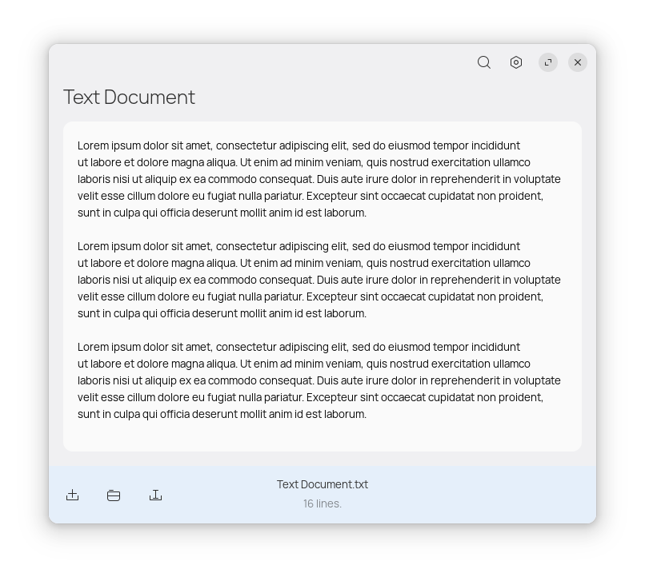

# Enigma

A simple text editor.

###

[](https://stopthemingmy.app)
[](http://www.gnu.org/licenses/gpl-3.0)



## 🛠️ Dependencies

Please make sure you have these dependencies first before building.

```bash
gtk4
libgee-0.8
libhelium-1.0
meson
vala
```

## 🏗️ Building

Simply clone this repo, then:

```bash
meson _build --prefix=/usr && cd _build
sudo ninja install
```
